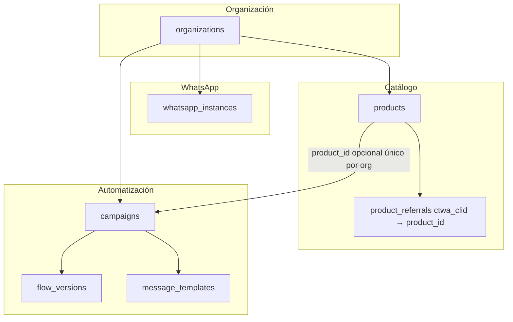

# Flujo de registro, instancia WhatsApp y bot por productos

Este documento describe **cómo se da de alta un cliente**, **cómo se conecta WhatsApp (Meta)** y **cómo encajan productos, campañas, flujos y plantillas** en la plataforma, según la implementación actual del repositorio.

---

## 1. Registro del cliente (sin registro público)

No hay auto-registro abierto. El flujo es:

1. **Dueño de plataforma** (email en tabla `platform_admins`, insertado en base de datos).
2. En el panel **`/admin`**, crea una **organización** (`organizations`: nombre + `slug`).
3. Añade filas en **`organization_signup_allowlist`**: `organization_id`, `email` (minúsculas), `role` (p. ej. `owner`).
4. El **primer usuario** con ese correo inicia sesión (Google, magic link u otro proveedor de Supabase Auth).
5. El backend (`authContext`) detecta el email en la allowlist, **inserta** en `organization_members` y **elimina** la fila de la allowlist.

A partir de ahí el cliente tiene membresía y puede usar el dashboard **tenant** con su organización.

**Cabecera para operaciones multi-org:** si un `platform_admin` debe gestionar datos de un cliente concreto, usa `X-Organization-Id` en las peticiones al API (ver `context.md`).

---

## 2. Conectar WhatsApp: instancia Meta

El “bot” en tiempo real entra por el **webhook** de Meta. El backend **no** adivina la organización por el token global del servidor: asocia cada número de la API de WhatsApp a una fila en **`whatsapp_instances`**.

| Campo relevante | Uso |
|------------------|-----|
| `organization_id` | A qué empresa pertenece esta línea. |
| `phone_number_id` | Lo envía Meta en cada evento (`metadata.phone_number_id`); debe coincidir con lo guardado. |
| `meta_token` | Token de envío para esa instancia (en la UI se pide al crear/editar). |
| `is_active` | Si es `false`, la instancia no se usa para resolver el webhook de forma útil. |

**Pasos prácticos:**

1. En **Meta for Developers**, configura la app de WhatsApp y obtén `phone_number_id` (y el token de acceso adecuado).
2. En el dashboard, sección **Instancias** (`/instances`), crea una instancia con **etiqueta**, **`phone_number_id`** y **`meta_token`**.
3. Apunta el **callback URL** del webhook de la app a tu backend: `https://<tu-dominio>/webhook`, con el mismo `VERIFY_TOKEN` que usa el servidor (`VERIFY_TOKEN` en env del backend).
4. Variables de entorno del backend útiles: `META_TOKEN` / `META_PHONE_ID` pueden existir como legacy, pero el **enrutado por organización** en el webhook se basa en **`whatsapp_instances`** + `phone_number_id` del payload.

Si el webhook llega con un `phone_number_id` **sin** instancia activa asociada, el mensaje se **ignora** (log de advertencia).

---

## 3. Productos: qué configuras

Tabla **`products`** (por organización):

| Concepto | Descripción |
|----------|-------------|
| `name` / `slug` | Identificación humana y única por org (`unique (organization_id, slug)`). |
| `is_active` | Solo productos activos entran en la inferencia por texto (`findProductByText`). |
| `system_prompt` | Texto que alimenta al modelo en **texto libre** vía Haiku: si hay contenido, se arma un prompt del estilo “Eres asistente del producto …” (`flows.ts` + `haiku.ts`). |
| `dispatch_keywords` | Lista **separada por comas**; se normaliza a palabras en minúsculas. Si el usuario escribe un mensaje que **contiene** alguna de esas palabras, el clasificador puede tratar el mensaje como tipo **`products`** (ver `classifier.ts`). |
| `config` | JSON libre (`jsonb`) para ampliar sin migración. |

**En el dashboard (`/products`):** creas productos y puedes marcar uno como **producto activo** (localStorage: clave de producto activo usada al crear campañas y al listar flujos).

**Detección de producto en el webhook (orden lógico):**

1. **Estado en Redis** (conversación ya llevaba `productId`).
2. **Click to WhatsApp (CTWA):** si el mensaje trae `referral.ctwa_clid`, se busca en **`product_referrals`** y se obtiene el `product_id`.
3. **Texto:** entre productos activos, el primero cuyas `dispatch_keywords` aparezcan en el texto del usuario.

Luego se resuelve la **campaña** asociada (siguiente sección).

---

## 4. Campañas: relación con productos

Las **campañas** existieron antes del modelo “product-first”; el esquema las **vincula** a un producto opcional:

- Columna **`campaigns.product_id`** → referencia a `products.id`.
- Índice único: **una campaña por par `(organization_id, product_id)`** cuando `product_id` no es nulo (`uq_campaigns_org_product`).

Eso implica: **para un mismo producto, a lo sumo una campaña enlazada** en ese diseño (la “campaña del producto”).

**Campos útiles de campaña** (además de nombre y `status`):

- `system_prompt`, `dispatch_keywords`, `product` (texto), `config` (jsonb) — alineados con el modelo multitenant original; pueden complementar o duplicar ideas del producto según cómo uses la UI.

**Resolución en API** (`resolveCampaignId` en `dashboard.ts`):

- Si pasas **`campaignId`**, se usa directamente.
- Si pasas **`productId`**, se busca la campaña con ese `product_id` en la organización.

**Flujos y plantillas** viven en tablas ligadas a **`campaign_id`** (`flow_versions`, `message_templates`). Por tanto:

- **Producto** → (vía `product_id`) → **Campaña** → **versiones de flujo** y **plantillas**.

En la UI:

- **Campañas** (`/campaigns`): al crear una campaña nueva, si hay **producto activo** seleccionado, se envía `productId` para crear la campaña ya enlazada (`CampaignsPage`).
- **Flujos** (`/flows`): se consultan pasando `productId` del producto activo; el backend resuelve la campaña y devuelve `flow_versions` de esa campaña.
- **Plantillas** (`/templates`): igual, filtro por `productId` o `campaignId` según implementación del cliente API.

Si creas un producto pero **no** existe una campaña con `product_id` apuntando a él, las llamadas que solo mandan `productId` **no encuentran campaña** → listados vacíos o error al crear flujo (“Campaign no encontrada para ese producto”).

---

## 5. Flujo recomendado “de cero” para un producto con bot

Orden sugerido alineado con el código:

1. **Organización + acceso** (admin plataforma: org + allowlist → primer login del cliente).
2. **Instancia WhatsApp** con `phone_number_id` y token correctos; webhook apuntando al backend.
3. **Crear producto** en `/products` (nombre, slug, `system_prompt`, `dispatch_keywords`).
4. **Seleccionar ese producto como activo** (acción en la misma página de productos).
5. **Crear campaña** en `/campaigns` (quedará en borrador y con `product_id` si había producto activo). **Activar** la campaña cuando corresponda (`status: active`).
6. Opcional: **Referrals** (`/referrals`) — mapear `ctwa_clid` → producto para anuncios Click to WhatsApp.
7. **Flujos** (`/flows`): crear versión, editar/publicar según tu flujo de trabajo (las versiones cuelgan de la campaña resuelta por producto).
8. **Plantillas** (`/templates`): mismas reglas de `campaign_id` vía `productId`.

---

## 6. Qué hace el bot en tiempo real (resumen)

1. **Clasificador** (`classifier.ts`): según tipo de mensaje (imagen → comprobante, interactivo → botón, texto → palabras clave globales y **keywords del producto** para “catálogo/productos”, etc.).
2. **Flujos predefinidos** (`flows.ts`): saludos, precio, pago, ayuda, etc., usando nombre del producto y, en texto libre, **Haiku** con el `system_prompt` del producto si existe.
3. **Comprobantes** (`receipts/handler.ts`): OCR y validación según configuración.
4. **Estado**: Redis por teléfono + `phone_number_id`; conversaciones persistidas con `organization_id`, `product_id`, `campaign_id`, `whatsapp_instance_id` cuando aplica.

**Importante:** la pantalla **Configuración** (`/config`) guarda **`/api/config/bot`** en un objeto **en memoria en el proceso** (`botConfig` en el servidor), con `systemPrompt` y `keywords` por defecto. **No sustituye** el `system_prompt` del **producto** en los flujos que ya usan `product.system_prompt` para Haiku. Trátalo como configuración global/demo salvo que unifiques el diseño en el futuro.

---

## 7. Diagrama de relaciones (modelo mental)

**Webhook:** `phone_number_id` → `whatsapp_instances` → `organization_id` → resto de la lógica en esa org.

**Mensaje entrante:** deduce `product_id` (Redis / CTWA / keywords) → `findCampaignIdByProductId` → `campaign_id` en estado y conversación.

---

## 8. Checklist rápido de configuración

| Paso | Dónde / qué |
|------|-------------|
| Dueño plataforma | Tabla `platform_admins` + UI `/admin` |
| Alta cliente | Org + allowlist → primer login |
| Línea WhatsApp | `/instances` + Meta Developer webhook → `GET/POST /webhook` |
| Producto | `/products`: prompt, keywords, activo |
| Campaña ligada | `/campaigns`: crear con producto activo; pasar a `active` |
| Ads CTWA | `/referrals`: `ctwa_clid` → producto |
| Flujos / plantillas | `/flows`, `/templates` con producto (y campaña resuelta) |
| Variables servidor | `VERIFY_TOKEN`, Supabase, Redis si aplica, `ANTHROPIC_API_KEY` para Haiku |

---

*Documento generado a partir del código en `backend/` y `dashboard/`. Si cambias índices únicos o `resolveCampaignId`, actualiza este archivo.*
